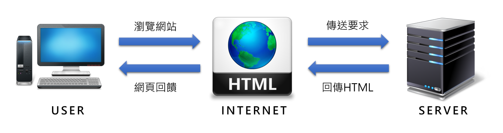

[TOC]

# HTML 簡介

## Q : 什麼是HTML？

* 超文本標記語言(Hyper Text Markup Language)，簡稱HTML，是一種標記語言(markuplanguage)
* HTML透過標記標籤(markuptag)來描述網頁
* HTML文檔包含HTML標籤和純文本，用HTML文檔描述網頁，在透過Web 瀏覽器讀取HTML文檔並以網頁的形式顯示，因此HTML文檔也被直接稱為網頁

## 網頁的基本運作模式

# 基本TAG介紹

* HTML 標記標籤通常被稱為HTML Tag
* Tag是由尖括號包圍的關鍵詞，比如`<html>`
* Tag通常是成對出現的，第一個標籤是開始標籤也稱為開放標籤，第二個標籤是結束標籤也稱為閉合標籤，比如`<b>` `</b>`和`<html>` `</html>`，但也有例外的情況，如換行` `、圖片``

# TAG的屬性與應用

* HTML TAG可以擁有屬性，屬性為HTML元素提供附加信息，讓網頁更加多樣化。
* 屬性以名稱+值的形式成對出現，比如：name="value"
* 屬性在HTML元素的開始標籤中設定，如下圖，width=“450”height=“80“代表圖片設定寬為450px，高80px。

# 表格的應用

* 表格由`<table>` 標籤來定義，每個表格均有若干行`<tr>`，每行被分割為若干單元格`<td>`。
* td 指表格數據（table data），即單元格的內容，可以包含文本、圖片、列表、段落、表單、水平線、表格等等。
* 表格的表頭使用`<th>` 標籤進行定義，大多數瀏覽器會把表頭顯示為粗體居中的文本。
* 透過使用邊框屬性border來顯示一個帶有邊框的表格。